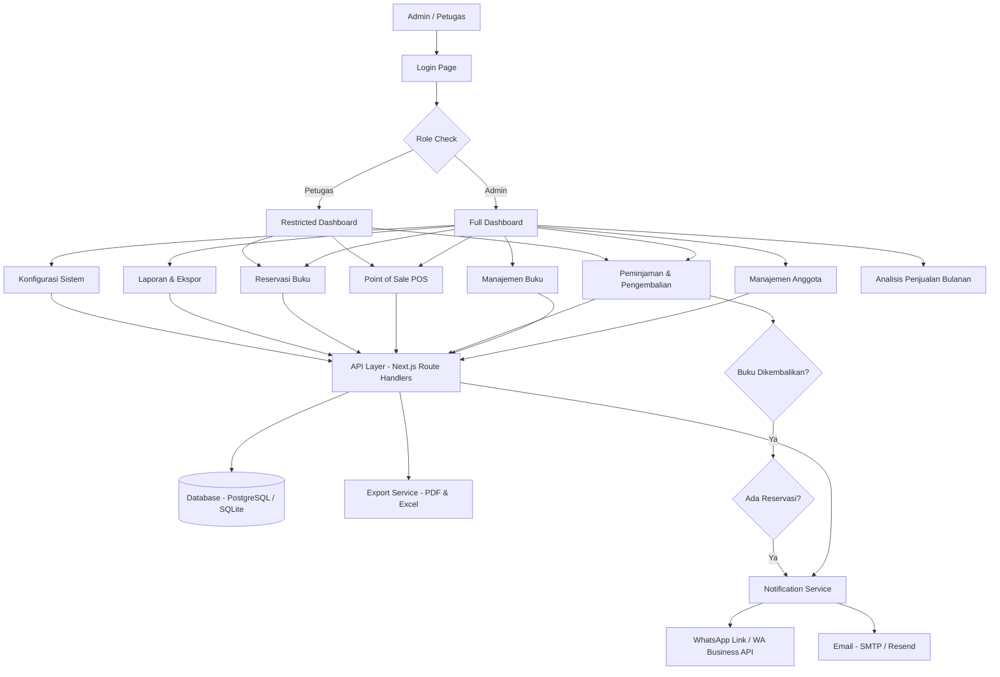
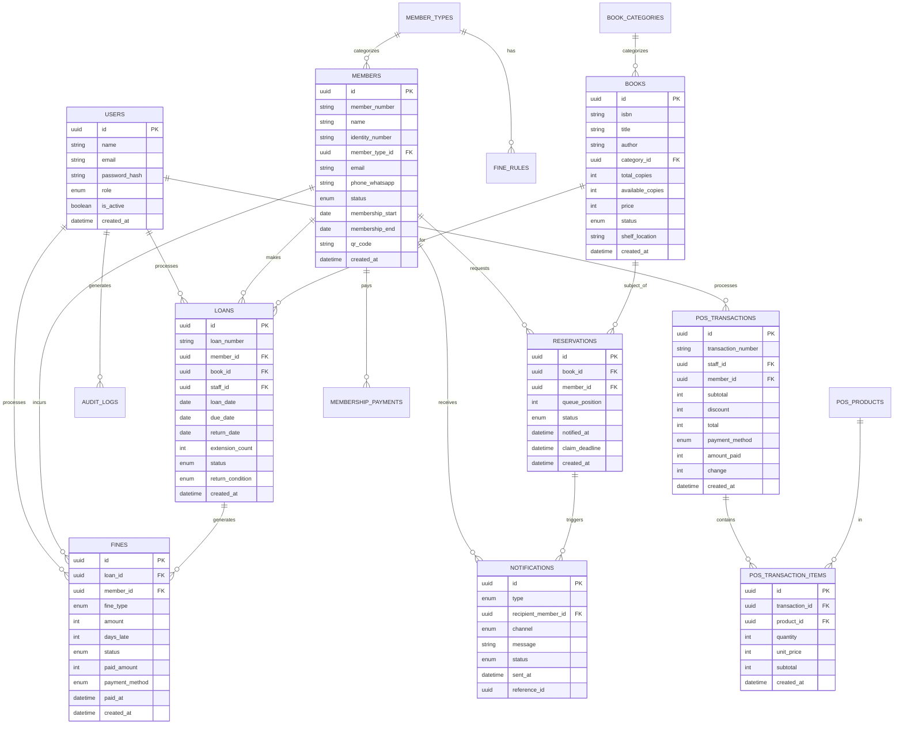

# PRD — Project Requirements Document
## SiKasir — Sistem Informasi Kasir Perpustakaan Modern

---

## 1. Overview

**SiKasir** adalah platform manajemen kasir perpustakaan berbasis web yang dirancang untuk Admin/Kepala Perpustakaan di institusi pendidikan maupun perpustakaan umum di Indonesia. Sistem ini bersifat all-in-one, menggabungkan fungsi kasir, manajemen keanggotaan, peminjaman & pengembalian, denda otomatis, Point of Sale (POS), laporan keuangan, reservasi buku, dan notifikasi dalam satu dashboard terpadu.

### Masalah yang Diselesaikan

- Pengelolaan peminjaman & pengembalian masih dilakukan secara manual (buku tulis/Excel), sehingga rawan kesalahan dan kehilangan data.
- Perhitungan denda keterlambatan dilakukan secara manual dan tidak konsisten.
- Tidak ada sistem keanggotaan digital; kartu anggota fisik mudah hilang dan sulit diverifikasi.
- Transaksi penjualan buku/ATK (Point of Sale) tidak tercatat dengan baik dan tidak terintegrasi ke laporan keuangan.
- Admin tidak memiliki visibilitas real-time terhadap stok buku, pendapatan, dan statistik perpustakaan.
- Tidak ada sistem reservasi/pre-order buku yang sedang dipinjam anggota lain.
- Komunikasi dengan anggota (pengingat jatuh tempo, konfirmasi booking) masih dilakukan manual via WhatsApp pribadi.

### Tujuan Utama Aplikasi

- Menyediakan dashboard terpusat bagi Admin/Kepala Perpustakaan untuk seluruh operasional.
- Mengotomatiskan perhitungan dan pencatatan denda keterlambatan.
- Menyediakan sistem keanggotaan digital lengkap dengan cetak kartu virtual.
- Mengintegrasikan Point of Sale untuk penjualan non-buku pinjaman.
- Menghasilkan laporan keuangan dan statistik yang dapat diekspor.
- Menyediakan sistem reservasi buku dengan notifikasi otomatis via WhatsApp/email.
- Menyimpan riwayat lengkap seluruh transaksi dan aktivitas perpustakaan.
- Menganalisis pola penjualan bulanan dari agregasi transaksi harian untuk mendukung pengambilan keputusan Admin.

---

## 2. Requirements

### Fungsional

- Sistem harus mendukung login aman untuk Admin dan Petugas Kasir dengan role berbeda.
- Admin dapat mengelola seluruh data: buku, anggota, peminjaman, pengembalian, denda, dan POS.
- Sistem harus menghitung denda keterlambatan secara otomatis berdasarkan aturan yang dapat dikonfigurasi oleh Admin.
- Sistem harus mencegah anggota dengan status denda aktif melakukan peminjaman baru.
- Sistem keanggotaan harus mendukung pendaftaran, perpanjangan, penangguhan, dan pencetakan kartu virtual anggota.
- Sistem POS harus mendukung transaksi tunai, transfer, dan QRIS untuk penjualan buku/ATK.
- Laporan keuangan harus mencakup pendapatan dari denda, POS, dan iuran keanggotaan.
- Semua laporan dan data harus dapat diekspor ke format PDF dan Excel/CSV.
- Sistem notifikasi harus mengirimkan pesan via WhatsApp link dan/atau email untuk pengingat jatuh tempo, konfirmasi peminjaman, dan status reservasi.
- Sistem reservasi harus menempatkan anggota dalam antrian dan mengirimkan notifikasi ketika buku tersedia.
- Profil perpustakaan dapat dikonfigurasi oleh Admin (nama, logo, alamat, aturan denda, batas pinjam).
- Sistem harus mobile-friendly karena Admin dapat mengakses dari perangkat berbeda.
- Riwayat seluruh aktivitas (peminjaman, pengembalian, pembayaran, POS) harus tersimpan permanen dan dapat difilter.
- Sistem harus mengagregasi transaksi harian secara otomatis menjadi ringkasan bulanan untuk analisis penjualan.
- Analisis penjualan harus mencakup perbandingan antar bulan (MoM), breakdown per sumber pendapatan, dan indikator tren.

### Non-Fungsional

- Aplikasi harus responsif dan dapat diakses dari desktop maupun mobile.
- Performa halaman utama dashboard < 2 detik.
- Data sensitif anggota harus dienkripsi.
- Sistem harus mendukung ekspor data tanpa batas waktu historis.
- UI harus intuitif sehingga dapat dioperasikan petugas tanpa pelatihan teknis mendalam.

---

## 3. User Roles

### Admin / Kepala Perpustakaan
- Akses penuh ke seluruh fitur sistem.
- Dapat mengonfigurasi aturan sistem (denda, batas pinjam, iuran keanggotaan).
- Dapat melihat semua laporan keuangan dan statistik.
- Dapat mengelola akun pengguna sistem (tambah/nonaktifkan Petugas).
- Dapat mengekspor semua data.

### Petugas Kasir
- Akses ke transaksi peminjaman, pengembalian, POS, dan pembayaran denda.
- Tidak dapat mengakses konfigurasi sistem dan laporan keuangan sensitif.
- Dapat melihat data anggota dan buku untuk keperluan transaksi.

---

## 4. Core Features

### 4.1 Dashboard Utama
- **Widget Ringkasan Harian**: total peminjaman hari ini, pengembalian hari ini, pendapatan POS hari ini, total denda terkumpul hari ini.
- **Widget Status Kritis**: buku terlambat dikembalikan (overdue), denda belum dibayar, reservasi pending.
- **Grafik Tren**: grafik peminjaman 7 hari terakhir, grafik pendapatan bulanan.
- **Aktivitas Terbaru**: log 10 transaksi terakhir dengan link ke detail.
- **Quick Action Buttons**: Pinjam Buku, Kembalikan Buku, Transaksi POS, Tambah Anggota.

### 4.2 Manajemen Keanggotaan
- **Pendaftaran Anggota**: formulir data lengkap (nama, NIM/NIP/NIK, email, nomor WhatsApp, foto, alamat, jenis anggota).
- **Jenis Anggota**: dapat dikonfigurasi Admin (misalnya: Mahasiswa, Dosen, Umum) dengan batas pinjam dan durasi keanggotaan berbeda.
- **Status Anggota**: Active, Expired, Suspended (karena denda), Blacklisted.
- **Kartu Anggota Virtual**: generate kartu anggota digital dengan QR Code unik per anggota, dapat dicetak atau disimpan sebagai gambar.
- **Perpanjangan Keanggotaan**: Admin dapat memperpanjang masa aktif dan mencatat pembayaran iuran.
- **Riwayat Anggota**: seluruh peminjaman, pengembalian, denda, dan transaksi POS per anggota.
- **Pencarian Anggota**: by nama, nomor anggota, NIM/NIP, atau scan QR Code.

### 4.3 Manajemen Buku & Inventori
- **Katalog Buku**: data lengkap (judul, pengarang, penerbit, tahun terbit, ISBN, kategori, deskripsi, cover, lokasi rak).
- **Manajemen Stok**: jumlah total eksemplar, jumlah tersedia, jumlah dipinjam, jumlah rusak/hilang.
- **Kategori & Tag**: sistem kategori hierarkis untuk mempermudah pencarian.
- **Status Buku**: Available, Borrowed, Reserved, Lost, Damaged.
- **Pencarian & Filter**: by judul, pengarang, ISBN, kategori, status.
- **Import Buku**: import data buku massal via file Excel/CSV.

### 4.4 Peminjaman & Pengembalian
- **Proses Peminjaman**:
  - Cari anggota (nama/nomor/scan QR).
  - Verifikasi status anggota (aktif, tidak ada denda, belum melebihi batas pinjam).
  - Cari dan pilih buku (judul/ISBN/scan barcode).
  - Set tanggal jatuh tempo otomatis berdasarkan aturan jenis anggota.
  - Generate slip peminjaman (dapat dicetak atau dikirim via WhatsApp).
- **Proses Pengembalian**:
  - Cari berdasarkan nomor peminjaman, anggota, atau scan QR buku.
  - Sistem otomatis menghitung denda jika terlambat.
  - Admin dapat mencatat kondisi buku (baik, rusak, hilang) dengan denda tambahan.
  - Pembayaran denda langsung di saat pengembalian.
  - Generate slip pengembalian.
- **Perpanjangan Peminjaman**: Admin dapat memperpanjang jatuh tempo maksimal N kali (dikonfigurasi).

### 4.5 Manajemen Denda
- **Kalkulasi Otomatis**: denda dihitung otomatis berdasarkan:
  - Denda per hari keterlambatan (dapat dikonfigurasi per jenis anggota).
  - Denda buku rusak (persentase atau nominal tetap).
  - Denda buku hilang (harga buku × koefisien, dikonfigurasi).
- **Status Denda**: Unpaid, Partial, Paid.
- **Pembayaran Denda**: tunai, transfer, atau QRIS; sistem mencatat metode pembayaran.
- **Riwayat Denda**: semua denda per anggota dengan status pembayaran.
- **Laporan Denda**: total denda terkumpul, denda outstanding, denda per periode.

### 4.6 Point of Sale (POS)
- **Produk POS**: admin dapat mengelola katalog produk yang dijual (buku baru, ATK, fotokopi, merchandise).
- **Antarmuka Kasir**: tampilan POS sederhana dan cepat dengan:
  - Pencarian produk cepat.
  - Keranjang belanja dengan kuantitas.
  - Kalkulasi total otomatis.
  - Diskon per item atau keseluruhan transaksi.
- **Metode Pembayaran POS**: Tunai (dengan kembalian otomatis), Transfer Bank, QRIS.
- **Struk POS**: generate struk digital yang dapat dicetak atau dikirim.
- **Manajemen Stok Produk**: stok produk POS berkurang otomatis saat transaksi.
- **Laporan POS**: pendapatan POS per hari/bulan/periode, produk terlaris.

### 4.7 Reservasi / Pre-Order Buku
- **Reservasi Buku**: anggota dapat mereservasi buku yang sedang dipinjam via Admin/Petugas.
- **Antrian Reservasi**: sistem antrian FIFO (first in, first out) per buku.
- **Notifikasi Tersedia**: ketika buku dikembalikan dan ada reservasi aktif, sistem otomatis mengirimkan notifikasi ke anggota berikutnya di antrian.
- **Batas Waktu Klaim**: anggota memiliki batas waktu N jam untuk mengklaim buku setelah notifikasi (dikonfigurasi Admin).
- **Status Reservasi**: Waiting, Ready to Pickup, Claimed, Expired, Cancelled.
- **Manajemen Reservasi**: Admin dapat melihat semua reservasi aktif, membatalkan, dan mengubah urutan prioritas.

### 4.8 Notifikasi (WhatsApp & Email)
- **Trigger Notifikasi Otomatis**:
  - Konfirmasi peminjaman berhasil.
  - Pengingat H-1 jatuh tempo peminjaman.
  - Notifikasi jatuh tempo (hari H).
  - Notifikasi keterlambatan (H+1, H+3, H+7).
  - Notifikasi buku reservasi tersedia.
  - Konfirmasi pengembalian dan pembayaran denda.
  - Notifikasi keanggotaan mendekati expired (H-7).
- **Metode Notifikasi**:
  - **WhatsApp**: via link `wa.me` dengan pesan pre-filled (MVP) atau WhatsApp Business API (enhancement).
  - **Email**: via SMTP (Nodemailer) atau layanan seperti Resend.
- **Template Notifikasi**: Admin dapat mengedit template pesan untuk setiap jenis notifikasi.
- **Log Notifikasi**: riwayat semua notifikasi yang telah dikirim beserta status.

### 4.9 Laporan & Statistik
- **Laporan Peminjaman**: jumlah peminjaman per periode, buku terpopuler, anggota paling aktif.
- **Laporan Keuangan**: pendapatan dari denda, POS, iuran keanggotaan; rekap harian/mingguan/bulanan/tahunan.
- **Laporan Inventori**: daftar buku, stok tersedia, buku rusak/hilang, buku overdue.
- **Laporan Keanggotaan**: jumlah anggota aktif/expired/suspended, anggota baru per periode.
- **Laporan Denda**: total denda terkumpul, outstanding, per anggota, per periode.
- **Dashboard Statistik Visual**: grafik interaktif (bar chart, line chart, pie chart).
- **Filter Laporan**: by tanggal, periode, kategori buku, jenis anggota, petugas.

### 4.10 Ekspor Data
- **Format Ekspor**: PDF (dengan logo & header perpustakaan), Excel (.xlsx), CSV.
- **Scope Ekspor**: semua laporan (peminjaman, keuangan, inventori, keanggotaan, denda).
- **Ekspor Data Anggota**: daftar anggota lengkap beserta status.
- **Ekspor Riwayat**: riwayat transaksi lengkap dengan filter tanggal.
- **Jadwal Ekspor Otomatis** (Enhancement): auto-generate laporan bulanan ke email Admin.

### 4.11 Riwayat & Audit Log
- **Riwayat Peminjaman**: semua transaksi peminjaman & pengembalian, tersortir dan terfilter.
- **Riwayat POS**: semua transaksi kasir dengan detail produk dan metode pembayaran.
- **Riwayat Denda**: semua denda yang pernah dikenakan dan status pembayarannya.
- **Audit Log Sistem**: log aktivitas Admin/Petugas (login, edit data, hapus data) untuk akuntabilitas.
- **Filter & Pencarian Riwayat**: by tanggal, anggota, petugas, jenis transaksi, status.

### 4.13 Analisis Penjualan Bulanan

Modul ini adalah **lapisan analitik** di atas data transaksi harian. Sistem secara otomatis mengagregasi semua transaksi (POS, denda, iuran keanggotaan) setiap hari menjadi snapshot harian, lalu menggabungkannya menjadi ringkasan bulanan yang siap dianalisis oleh Admin.

#### Sumber Data Agregasi
Analisis menarik data secara real-time dari 3 sumber transaksi:
- **POS** (`pos_transactions`) — pendapatan penjualan buku/ATK.
- **Denda** (`fines`) — pendapatan denda keterlambatan, kerusakan, dan kehilangan buku.
- **Iuran Keanggotaan** (`membership_payments`) — pendapatan dari pendaftaran dan perpanjangan anggota.

#### Proses Agregasi Otomatis Harian
- Setiap hari (via cron job atau `trigger on-write`), sistem membuat atau memperbarui 1 baris `daily_transaction_summaries` untuk tanggal hari tersebut.
- Baris ini menyimpan: total pendapatan hari itu, jumlah transaksi, breakdown per sumber, jam dengan transaksi terbanyak (peak hour), dan metode pembayaran yang paling sering digunakan.
- Data harian ini menjadi sumber akurat untuk analisis bulanan tanpa perlu query berat ke tabel transaksi utama setiap saat.

#### Tampilan Analisis Bulanan
Admin membuka halaman **Analisis Penjualan** dan memilih bulan yang ingin dianalisis. Sistem menampilkan:

- **Kartu KPI Utama Bulan**:
  - Total pendapatan bulan ini.
  - Jumlah total transaksi bulan ini.
  - Rata-rata pendapatan per hari aktif.
  - Hari dengan pendapatan tertinggi (peak day).
  - Hari dengan pendapatan terendah atau nol transaksi.

- **Grafik Tren Harian dalam Bulan** (Line Chart):
  - Sumbu X: tanggal 1–31.
  - Sumbu Y: total pendapatan per hari.
  - 3 garis terpisah berwarna berbeda: pendapatan POS, pendapatan denda, pendapatan iuran.
  - Tooltip interaktif saat hover: detail breakdown dan jumlah transaksi per hari.
  - Anotasi otomatis pada titik tertinggi (peak) dan terendah (valley).

- **Grafik Komposisi Pendapatan** (Stacked Bar atau Pie Chart):
  - Proporsi pendapatan dari POS vs Denda vs Iuran Keanggotaan.
  - Persentase kontribusi masing-masing sumber.

- **Perbandingan Bulan ke Bulan — MoM (Month-over-Month)**:
  - Tabel perbandingan: bulan ini vs bulan lalu vs 2 bulan lalu.
  - Kolom: total pendapatan, jumlah transaksi, rata-rata harian, pendapatan POS, pendapatan denda, pendapatan iuran.
  - Indikator naik/turun (↑ hijau / ↓ merah) dengan persentase perubahan.
  - Grafik bar komparasi 6 bulan terakhir untuk melihat tren jangka menengah.

- **Perbandingan Tahun ke Tahun — YoY (Year-over-Year)**:
  - Perbandingan bulan yang sama di tahun berbeda (misal: Mei 2025 vs Mei 2024).
  - Indikator pertumbuhan tahunan.

- **Analisis Peak Hour (Jam Tersibuk)**:
  - Heatmap jam operasional: sumbu X jam (08:00–17:00), sumbu Y hari dalam minggu.
  - Warna lebih gelap = volume transaksi lebih tinggi.
  - Insight otomatis: "Jam tersibuk: Selasa 10:00–11:00" dan "Hari paling sepi: Jumat".

- **Analisis Produk POS Terlaris Bulanan**:
  - Top 5 produk berdasarkan pendapatan bulan ini.
  - Top 5 produk berdasarkan volume/kuantitas terjual.
  - Perbandingan dengan bulan sebelumnya (naik/turun posisi ranking).

- **Analisis Denda per Kategori**:
  - Breakdown denda: keterlambatan vs kerusakan vs kehilangan.
  - Anggota dengan denda terbesar bulan ini (tanpa melanggar privasi — hanya untuk Admin).

- **Proyeksi Pendapatan Bulan Berjalan** (jika bulan belum selesai):
  - Berdasarkan rata-rata transaksi N hari pertama bulan ini, sistem memproyeksikan total akhir bulan.
  - Menggunakan Simple Moving Average (SMA-7) dari 7 hari terakhir.
  - Ditampilkan dengan label "Proyeksi" dan confidence range (min–max berdasarkan data historis).
  - Bukan machine learning — cukup kalkulasi statistik sederhana yang transparan.

- **Ringkasan Insight Otomatis** (Auto-generated text summary):
  - Sistem men-generate 3–5 kalimat ringkasan berdasarkan data, misalnya:
    - "Pendapatan bulan Mei 2025 naik 12% dibanding April 2025."
    - "Sumber pendapatan terbesar bulan ini adalah POS (68%) dengan produk terlaris: Pulpen Ballpoint."
    - "Terdapat 5 hari tanpa transaksi di minggu ke-3, perlu dievaluasi."

#### Filter & Navigasi
- Pilih bulan dan tahun via date picker.
- Tombol navigasi cepat: ← Bulan Sebelumnya | Bulan Ini | Bulan Berikutnya →.
- Toggle tampilan: Chart View ↔ Table View.
- Filter sumber pendapatan: tampilkan semua / POS saja / Denda saja / Iuran saja.

#### Ekspor Laporan Analisis
- Ekspor ke **PDF**: laporan bulanan lengkap dengan semua grafik, KPI, dan tabel perbandingan. Siap dilaporkan ke pimpinan institusi.
- Ekspor ke **Excel**: data mentah harian + tabel agregat bulanan dalam sheet terpisah.
- Tombol **Bandingkan Periode**: pilih 2 bulan berbeda untuk analisis side-by-side.

### 4.12 Profil & Konfigurasi Sistem
- **Profil Perpustakaan**: nama, logo, alamat, nomor telepon, email, jam operasional.
- **Konfigurasi Aturan**:
  - Denda per hari per jenis anggota.
  - Batas maksimal buku yang dapat dipinjam per jenis anggota.
  - Durasi peminjaman default per jenis anggota.
  - Maksimal perpanjangan peminjaman.
  - Batas waktu klaim reservasi.
  - Biaya iuran keanggotaan per jenis.
- **Manajemen Pengguna Sistem**: tambah/edit/nonaktifkan akun Petugas Kasir.
- **Konfigurasi Notifikasi**: aktifkan/nonaktifkan setiap jenis notifikasi, edit template.
- **Konfigurasi Pembayaran**: data rekening bank dan QRIS untuk instruksi pembayaran.

---

## 5. User Flow

### Flow Peminjaman Buku
1. Petugas membuka menu **Peminjaman Baru**.
2. Petugas mencari anggota by nama/nomor/scan QR.
3. Sistem menampilkan status anggota (aktif/denda/batas pinjam).
4. Jika anggota valid, Petugas mencari buku yang ingin dipinjam.
5. Sistem memeriksa ketersediaan buku.
6. Petugas mengonfirmasi dan mencetak/mengirim slip peminjaman.
7. Sistem mengubah status buku menjadi `Borrowed` dan mencatat tanggal jatuh tempo.
8. Sistem mengirimkan notifikasi konfirmasi ke anggota via WhatsApp/email.

### Flow Pengembalian & Denda
1. Petugas membuka menu **Pengembalian Buku**.
2. Petugas mencari transaksi by nomor peminjaman/anggota/scan QR buku.
3. Sistem menampilkan detail peminjaman dan menghitung denda jika terlambat.
4. Petugas memilih kondisi buku (baik/rusak/hilang) — denda tambahan ditambahkan otomatis jika rusak/hilang.
5. Anggota membayar denda (tunai/transfer/QRIS).
6. Petugas mengonfirmasi pembayaran.
7. Sistem mengubah status buku menjadi `Available` (atau `Damaged`/`Lost`).
8. Sistem memeriksa antrian reservasi — jika ada, notifikasi dikirim ke anggota berikutnya.
9. Sistem mencetak/mengirim slip pengembalian.

### Flow Transaksi POS
1. Petugas membuka menu **Kasir POS**.
2. Petugas mencari produk yang dibeli.
3. Petugas menambahkan produk ke keranjang dan mengatur kuantitas.
4. Sistem menghitung total harga.
5. Petugas memilih metode pembayaran dan memasukkan nominal (untuk hitung kembalian tunai).
6. Petugas mengonfirmasi transaksi.
7. Sistem mencatat transaksi, mengurangi stok, dan mencetak/menampilkan struk.

### Flow Reservasi Buku
1. Anggota meminta reservasi buku yang sedang dipinjam kepada Petugas.
2. Petugas membuka menu **Reservasi**, mencari buku, dan menambahkan anggota ke antrian.
3. Sistem mencatat reservasi dengan status `Waiting`.
4. Ketika buku dikembalikan, sistem otomatis mengirim notifikasi ke anggota pertama di antrian.
5. Status reservasi berubah menjadi `Ready to Pickup`.
6. Anggota memiliki batas waktu N jam untuk mengklaim. Jika tidak, reservasi `Expired` dan notifikasi dikirim ke anggota berikutnya.
7. Jika anggota datang, Petugas memproses peminjaman dan status reservasi menjadi `Claimed`.

### Flow Admin Analisis Penjualan Bulanan
1. Admin membuka menu **Analisis Penjualan**.
2. Sistem menampilkan analisis bulan berjalan secara default.
3. Sistem mengambil data dari `daily_transaction_summaries` untuk bulan yang dipilih.
4. Admin melihat KPI utama: total pendapatan, jumlah transaksi, rata-rata harian.
5. Admin mengamati grafik tren harian (3 garis: POS, Denda, Iuran).
6. Admin melihat tabel MoM untuk membandingkan dengan 2 bulan sebelumnya.
7. Sistem menampilkan insight otomatis berupa teks ringkasan performa bulan tersebut.
8. Admin menggunakan filter untuk melihat analisis per sumber pendapatan tertentu.
9. Admin menekan **Ekspor PDF** untuk mendapatkan laporan siap cetak/presentasi.
10. Jika ingin membandingkan, Admin menekan **Bandingkan Periode** dan memilih 2 bulan.

### Flow Admin Laporan & Ekspor
1. Admin membuka menu **Laporan**.
2. Admin memilih jenis laporan (Keuangan, Peminjaman, Inventori, dll.).
3. Admin mengatur filter periode dan parameter lain.
4. Sistem menampilkan data dalam tabel dan grafik visual.
5. Admin menekan tombol **Ekspor** dan memilih format (PDF/Excel/CSV).
6. Sistem meng-generate file dan mendownloadnya otomatis.

---

## 6. Architecture

Aplikasi menggunakan arsitektur full-stack web app modern dengan Next.js sebagai framework utama yang menangani frontend (dashboard admin, POS, laporan) sekaligus backend API (route handler) dalam satu project.

**Komponen Utama:**
- **Auth Module**: login berbasis role (Admin & Petugas) menggunakan Better Auth.
- **Member Engine**: manajemen siklus hidup keanggotaan + QR Code generator.
- **Circulation Engine**: logika peminjaman, pengembalian, perpanjangan, dan pencegahan konflik.
- **Fine Calculator**: modul kalkulasi denda otomatis berdasarkan konfigurasi.
- **POS Engine**: modul kasir dengan manajemen keranjang, stok, dan pembayaran.
- **Reservation Queue**: antrian FIFO reservasi buku dengan sistem notifikasi.
- **Notification Service**: orkestrasi pengiriman WhatsApp link dan email.
- **Reporting Engine**: agregasi data untuk laporan dan grafik.
- **Analytics Engine**: agregasi otomatis transaksi harian ke `daily_transaction_summaries`, komputasi bulanan ke `monthly_sales_analysis`, kalkulasi MoM/YoY, proyeksi SMA-7, dan generate insight teks otomatis.
- **Export Service**: generate file PDF (via Puppeteer/jsPDF) dan Excel (via ExcelJS).

---

## 7. Database Schema

### `users`
Menyimpan akun Admin dan Petugas Kasir.
- `id` — uuid, ID unik user.
- `name` — text, nama lengkap.
- `email` — text, email untuk login.
- `password_hash` — text, hash password.
- `role` — enum: `admin`, `staff`.
- `is_active` — boolean, status akun aktif.
- `created_at` — datetime.

### `library_config`
Menyimpan konfigurasi perpustakaan (1 baris, singleton).
- `id` — uuid.
- `library_name` — text, nama perpustakaan.
- `address` — text, alamat.
- `phone` — text, nomor telepon.
- `email` — text, email perpustakaan.
- `logo_url` — text, URL logo.
- `open_time` — time, jam buka.
- `close_time` — time, jam tutup.
- `updated_at` — datetime.

### `fine_rules`
Menyimpan aturan denda yang dapat dikonfigurasi.
- `id` — uuid.
- `member_type_id` — uuid FK, relasi ke jenis anggota.
- `fine_per_day` — integer, denda per hari keterlambatan (Rupiah).
- `damaged_fine_type` — enum: `fixed`, `percentage`.
- `damaged_fine_value` — integer, nominal atau persentase denda buku rusak.
- `lost_fine_multiplier` — float, pengali harga buku untuk denda hilang.
- `updated_at` — datetime.

### `member_types`
Menyimpan jenis keanggotaan.
- `id` — uuid.
- `name` — text (misal: Mahasiswa, Dosen, Umum).
- `max_borrow_count` — integer, batas maksimal buku dipinjam.
- `borrow_duration_days` — integer, durasi pinjam default.
- `max_extension_count` — integer, maksimal perpanjangan.
- `membership_fee` — integer, biaya iuran keanggotaan (Rupiah).
- `membership_duration_days` — integer, masa aktif keanggotaan.
- `is_active` — boolean.

### `members`
Menyimpan data anggota perpustakaan.
- `id` — uuid.
- `member_number` — text, nomor anggota unik (auto-generate).
- `name` — text, nama lengkap.
- `identity_number` — text, NIM/NIP/NIK.
- `member_type_id` — uuid FK.
- `email` — text.
- `phone_whatsapp` — text.
- `address` — text.
- `photo_url` — text.
- `qr_code` — text, data QR Code unik.
- `status` — enum: `active`, `expired`, `suspended`, `blacklisted`.
- `membership_start` — date, mulai masa aktif.
- `membership_end` — date, akhir masa aktif.
- `notes` — text, catatan Admin.
- `created_at` — datetime.

### `books`
Menyimpan katalog buku.
- `id` — uuid.
- `isbn` — text, ISBN buku.
- `title` — text, judul buku.
- `author` — text, pengarang.
- `publisher` — text, penerbit.
- `publish_year` — integer, tahun terbit.
- `category_id` — uuid FK.
- `description` — text.
- `cover_url` — text, URL cover buku.
- `shelf_location` — text, lokasi rak.
- `total_copies` — integer, total eksemplar.
- `available_copies` — integer, eksemplar tersedia.
- `price` — integer, harga buku (untuk kalkulasi denda hilang).
- `status` — enum: `available`, `borrowed`, `reserved`, `all_borrowed`.
- `created_at` — datetime.

### `book_categories`
Menyimpan kategori buku.
- `id` — uuid.
- `name` — text, nama kategori.
- `parent_id` — uuid nullable FK, untuk kategori hierarkis.

### `loans`
Menyimpan transaksi peminjaman.
- `id` — uuid.
- `loan_number` — text, nomor peminjaman unik.
- `member_id` — uuid FK.
- `book_id` — uuid FK.
- `staff_id` — uuid FK, petugas yang memproses.
- `loan_date` — date, tanggal pinjam.
- `due_date` — date, tanggal jatuh tempo.
- `return_date` — date nullable, tanggal dikembalikan.
- `extension_count` — integer, sudah diperpanjang berapa kali.
- `status` — enum: `active`, `returned`, `overdue`, `lost`.
- `return_condition` — enum nullable: `good`, `damaged`, `lost`.
- `notes` — text.
- `created_at` — datetime.

### `fines`
Menyimpan data denda.
- `id` — uuid.
- `loan_id` — uuid FK, relasi ke peminjaman.
- `member_id` — uuid FK.
- `fine_type` — enum: `late_return`, `damaged`, `lost`.
- `amount` — integer, total denda (Rupiah).
- `days_late` — integer nullable, jumlah hari terlambat.
- `status` — enum: `unpaid`, `partial`, `paid`.
- `paid_amount` — integer, jumlah yang sudah dibayar.
- `payment_method` — enum nullable: `cash`, `transfer`, `qris`.
- `paid_at` — datetime nullable.
- `processed_by` — uuid FK nullable, petugas yang memproses pembayaran.
- `notes` — text.
- `created_at` — datetime.

### `reservations`
Menyimpan data reservasi buku.
- `id` — uuid.
- `book_id` — uuid FK.
- `member_id` — uuid FK.
- `staff_id` — uuid FK, petugas yang membuat reservasi.
- `queue_position` — integer, posisi antrian.
- `status` — enum: `waiting`, `ready`, `claimed`, `expired`, `cancelled`.
- `notified_at` — datetime nullable, waktu notifikasi dikirim.
- `claim_deadline` — datetime nullable, batas waktu klaim.
- `notes` — text.
- `created_at` — datetime.

### `pos_products`
Menyimpan katalog produk POS.
- `id` — uuid.
- `name` — text, nama produk.
- `category` — text, kategori produk (buku baru, ATK, dll).
- `price` — integer, harga jual (Rupiah).
- `stock` — integer, stok tersedia.
- `unit` — text, satuan (pcs, lembar, dll).
- `barcode` — text nullable.
- `is_active` — boolean.
- `created_at` — datetime.

### `pos_transactions`
Menyimpan transaksi POS.
- `id` — uuid.
- `transaction_number` — text, nomor transaksi unik.
- `staff_id` — uuid FK.
- `member_id` — uuid nullable FK, jika pembeli adalah anggota.
- `subtotal` — integer.
- `discount` — integer.
- `total` — integer.
- `payment_method` — enum: `cash`, `transfer`, `qris`.
- `amount_paid` — integer, nominal dibayar.
- `change` — integer, kembalian.
- `notes` — text.
- `created_at` — datetime.

### `pos_transaction_items`
Menyimpan detail item per transaksi POS.
- `id` — uuid.
- `transaction_id` — uuid FK.
- `product_id` — uuid FK.
- `quantity` — integer.
- `unit_price` — integer.
- `discount` — integer.
- `subtotal` — integer.

### `membership_payments`
Menyimpan pembayaran iuran keanggotaan.
- `id` — uuid.
- `member_id` — uuid FK.
- `staff_id` — uuid FK.
- `amount` — integer.
- `payment_method` — enum: `cash`, `transfer`, `qris`.
- `period_start` — date.
- `period_end` — date.
- `notes` — text.
- `created_at` — datetime.

### `notifications`
Menyimpan log notifikasi yang dikirim.
- `id` — uuid.
- `type` — enum: `loan_confirmed`, `due_reminder`, `overdue_notice`, `reservation_ready`, `return_confirmed`, `membership_expiry`.
- `recipient_member_id` — uuid FK.
- `channel` — enum: `whatsapp`, `email`.
- `message` — text, isi pesan.
- `status` — enum: `sent`, `failed`, `pending`.
- `sent_at` — datetime.
- `reference_id` — uuid nullable, ID loan/reservation yang terkait.

### `daily_transaction_summaries`
Menyimpan snapshot agregasi transaksi per hari — dibuat/diperbarui otomatis oleh sistem setiap ada transaksi baru atau via cron job akhir hari. Tabel ini adalah fondasi modul Analisis Penjualan sehingga query analitik tidak membebani tabel transaksi utama.

- `id` — uuid.
- `summary_date` — date, tanggal ringkasan (UNIQUE, 1 baris per hari).
- `total_revenue` — integer, total pendapatan hari itu (Rupiah).
- `total_transactions` — integer, jumlah transaksi dari semua sumber.
- `pos_revenue` — integer, pendapatan dari POS.
- `pos_transaction_count` — integer, jumlah transaksi POS.
- `fine_revenue` — integer, pendapatan dari pembayaran denda.
- `fine_transaction_count` — integer, jumlah transaksi denda terbayar.
- `membership_revenue` — integer, pendapatan dari iuran keanggotaan.
- `membership_transaction_count` — integer, jumlah pembayaran iuran.
- `cash_revenue` — integer, total pendapatan metode tunai.
- `transfer_revenue` — integer, total pendapatan metode transfer.
- `qris_revenue` — integer, total pendapatan metode QRIS.
- `peak_hour` — integer nullable, jam dengan transaksi terbanyak (format 0–23).
- `peak_hour_transaction_count` — integer nullable, jumlah transaksi di peak hour.
- `new_loans_count` — integer, jumlah peminjaman baru hari itu.
- `returns_count` — integer, jumlah pengembalian buku hari itu.
- `new_members_count` — integer, jumlah anggota baru hari itu.
- `updated_at` — datetime, terakhir diperbarui.

### `monthly_sales_analysis`
Menyimpan ringkasan bulanan yang di-compute dari `daily_transaction_summaries`. Di-generate otomatis setiap awal bulan baru untuk bulan sebelumnya, atau on-demand saat Admin membuka halaman analisis.

- `id` — uuid.
- `year` — integer, tahun (misal: 2025).
- `month` — integer, bulan 1–12.
- `total_revenue` — integer, total pendapatan bulan.
- `total_transactions` — integer, total transaksi bulan.
- `avg_daily_revenue` — integer, rata-rata pendapatan per hari aktif.
- `active_days` — integer, jumlah hari dengan minimal 1 transaksi.
- `peak_day` — date, tanggal dengan pendapatan tertinggi.
- `peak_day_revenue` — integer, pendapatan di hari puncak.
- `lowest_day` — date nullable, tanggal dengan pendapatan terendah (> 0).
- `pos_revenue` — integer, total pendapatan POS bulan ini.
- `fine_revenue` — integer, total pendapatan denda bulan ini.
- `membership_revenue` — integer, total pendapatan iuran bulan ini.
- `pos_percentage` — float, persentase kontribusi POS terhadap total.
- `fine_percentage` — float, persentase kontribusi denda terhadap total.
- `membership_percentage` — float, persentase kontribusi iuran terhadap total.
- `mom_growth_percentage` — float nullable, pertumbuhan vs bulan sebelumnya (%).
- `yoy_growth_percentage` — float nullable, pertumbuhan vs bulan sama tahun lalu (%).
- `top_pos_product_id` — uuid nullable FK, produk POS terlaris bulan ini.
- `top_pos_product_revenue` — integer nullable, pendapatan produk terlaris.
- `total_new_loans` — integer, total peminjaman buku bulan ini.
- `total_returns` — integer, total pengembalian bulan ini.
- `total_new_members` — integer, total anggota baru bulan ini.
- `generated_at` — datetime, waktu kalkulasi terakhir.

### `audit_logs`
Menyimpan log aktivitas pengguna sistem.
- `id` — uuid.
- `user_id` — uuid FK.
- `action` — text, jenis aksi (create, update, delete, login).
- `entity_type` — text, tabel yang dipengaruhi.
- `entity_id` — uuid, ID data yang dipengaruhi.
- `old_value` — jsonb nullable, nilai sebelum perubahan.
- `new_value` — jsonb nullable, nilai sesudah perubahan.
- `ip_address` — text.
- `created_at` — datetime.

---

### ER Diagram

---

## 8. Tech Stack

| Layer | Teknologi | Alasan |
|---|---|---|
| **Framework** | Next.js 14 (App Router) | Full-stack dalam satu project; SSR untuk performa; API Route Handlers untuk backend |
| **Styling** | Tailwind CSS | Cepat, responsif, dan mudah dikustomisasi |
| **UI Components** | shadcn/ui | Komponen siap pakai berkualitas tinggi (table, dialog, form, chart, calendar) |
| **ORM** | Drizzle ORM | Type-safe, ringan, cocok untuk schema kompleks |
| **Database** | SQLite (MVP) → PostgreSQL (Produksi) | SQLite untuk development cepat; PostgreSQL untuk produksi multi-user |
| **Authentication** | Better Auth | Role-based auth (Admin & Petugas) yang sederhana namun kuat |
| **Charts** | Recharts | Grafik statistik dan laporan keuangan interaktif |
| **PDF Export** | jsPDF + html2canvas | Generate laporan PDF dengan header perpustakaan |
| **Excel Export** | ExcelJS | Generate file .xlsx berkualitas tinggi |
| **QR Code** | qrcode.js | Generate QR Code kartu anggota |
| **Email** | Nodemailer / Resend | Pengiriman notifikasi email |
| **File Upload** | UploadThing | Upload foto anggota, cover buku, QRIS |
| **Deployment** | Vercel | Deploy mudah dan gratis untuk Next.js |

### Enhancement Opsional (Post-MVP)
- **PostgreSQL** untuk skala produksi multi-user.
- **WhatsApp Business API** (via Fonnte/WabizAPI) untuk notifikasi WhatsApp otomatis.
- **Midtrans/Xendit** untuk pembayaran iuran dan denda secara online.
- **Barcode Scanner** (via `quagga.js`) untuk scan buku dan kartu anggota via kamera HP.
- **PWA** untuk pengalaman mobile yang lebih baik bagi Petugas.
- **Multi-cabang** jika perpustakaan memiliki lebih dari satu lokasi.

---

## 9. Prioritas Pengembangan (Roadmap)

### Phase 1 — MVP Core (4–6 Minggu)
- [ ] Setup project Next.js + Drizzle + Better Auth
- [ ] Skema database lengkap
- [ ] Autentikasi Admin & Petugas (role-based)
- [ ] Manajemen Anggota (CRUD + kartu virtual)
- [ ] Manajemen Buku & Kategori (CRUD)
- [ ] Peminjaman & Pengembalian
- [ ] Kalkulasi Denda Otomatis
- [ ] Dashboard ringkasan

### Phase 2 — Enhanced Features (3–4 Minggu)
- [ ] Point of Sale (POS) lengkap
- [ ] Sistem Reservasi & Antrian
- [ ] Notifikasi WhatsApp Link & Email
- [ ] Laporan & Statistik Visual
- [ ] Agregasi harian otomatis (`daily_transaction_summaries`)
- [ ] Modul Analisis Penjualan Bulanan (grafik tren, MoM, YoY, peak hour, insight otomatis)
- [ ] Proyeksi pendapatan SMA-7
- [ ] Ekspor laporan analisis PDF & Excel

### Phase 3 — Production Ready (2–3 Minggu)
- [ ] Ekspor PDF & Excel semua laporan
- [ ] Riwayat & Audit Log lengkap
- [ ] Konfigurasi sistem oleh Admin
- [ ] Manajemen pengguna sistem
- [ ] Optimasi performa & UX
- [ ] Migrasi ke PostgreSQL
- [ ] Deployment ke Vercel

---

*Dokumen ini dibuat sebagai acuan pengembangan SiKasir — Sistem Informasi Kasir Perpustakaan. Dapat diperbarui sesuai kebutuhan tim pengembang.*